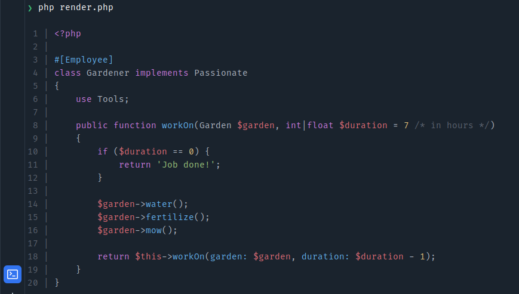
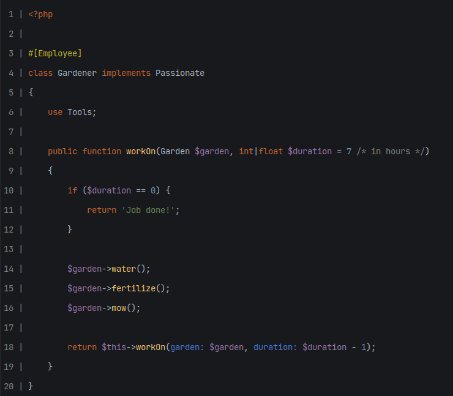

# tin

tin is a code highlighter for PHP (Terminal, HTML, etc.).

[](https://github.com/felixdorn/tin/actions/workflows/tests.yml)
[](https://github.com/felixdorn/tin/actions/workflows/formats.yml)
[](//packagist.org/packages/felixdorn/tin)
[](//packagist.org/packages/felixdorn/tin)
[](//packagist.org/packages/felixdorn/tin)

## Installation

> Requires [PHP 8.3+](https://php.net/releases)

You can install the package via composer:

```bash
composer require felixdorn/tin
```

## Screenshots





Yes, this comes from a terminal.

## Usage

```php
<?php

use Felix\Tin\Themes\JetbrainsDark;
use Felix\Tin\Tin;

echo Tin::from(JetbrainsDark::class, $ansi = true)->highlight("<?php\n\necho 'Hello world';\n");
```

## Customizing the output

You have complete control over the highlighting process. Implement
the [`Felix\Tin\Contracts\OutputInterface`](src/Contracts/OutputInterface.php) interface or implement a custom theme if
you are just looking to change the colors.

## Outputs

* [`Felix\Tin\Themes\AnsiOutput`](src/Outputs/AnsiOutput.php)
* [`Felix\Tin\Themes\CallableOutput`](src/Outputs/CallableOutput.php)
* [`Felix\Tin\Themes\HtmlOutput`](src/Outputs/HtmlOutput.php)

## Themes

Themes define the colors used by outputs. The format is `r;g;b`, to match ANSI default format.

* [`Felix\Tin\Themes\JetbrainsDark`](src/Themes/JetbrainsDark.php)
* [`Felix\Tin\Themes\OneDark`](src/Themes/OneDark.php)

### Creating a theme

You need to extend `Felix\Tin\Themes\Theme` and set the colors to whatever you want.

The color are RGB values separated by a `;`.

```php
use Felix\Tin\Contracts\ThemeInterface;
use Felix\Tin\Enums\TokenType;

class OneDark extends ThemeInterface
{
    /** {@inheritDoc} */
    public function color(TokenType $type): string
    {
        return match ($type) {
            TokenType::Keyword  => '199;120;221',
            TokenType::Variable => '224;107;116',
            TokenType::Comment  => '91;98;110',
            TokenType::String   => '152;195;121',
            TokenType::Function, TokenType::NamedParameter, TokenType::Attribute => '98;174;239',
            TokenType::Number, TokenType::Html => '229;192;122',
            default => '171;178;191',
        };
    }
}
```

## Testing

```bash
composer test
```

**tin** was created by **[Félix Dorn](https://twitter.com/afelixdorn)** under
the **[MIT license](https://opensource.org/licenses/MIT)**.
